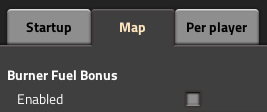

A mod for [Factorio](https://www.factorio.com) that makes burner inserters and machines run faster if their fuel has an acceleration bonus.

### Features
---
Burner inserters and machines run faster if their fuel has an acceleration bonus.

Supported buildings include:
* Inserters
* Furnaces
* Mining drills
* Assembling machines*
* Labs*
* Pumps*
* Radars*

\*Not available in vanilla Factorio

### Uninstalling
---
It is recommended to turn off the mod using mod settings before removing it from a map. Otherwise your burner buildings may be deleted.

